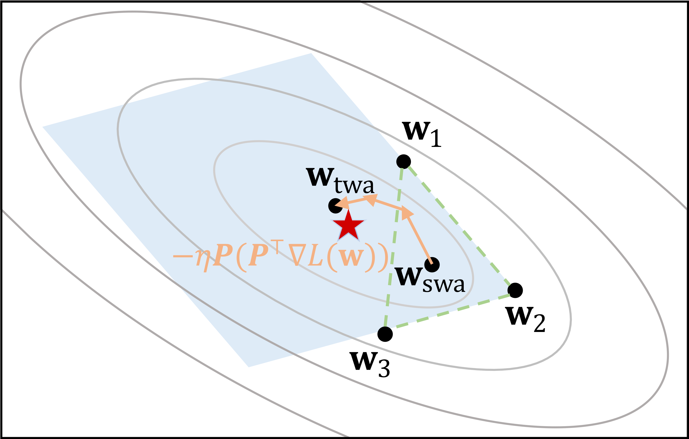

# TWA
The code is the official implementation of our ICLR paper 
[Trainable Weight Averaging: Efficient Training by Optimizing Historical Solutions](https://openreview.net/pdf?id=8wbnpOJY-f). 

We propose to conduct neural network training in a tiny subspace spanned by historical solutions. Such optimization is equivalent to performing weight averaging on these solutions with trainable coefficients (TWA), in contrast with the equal averaging coefficients as in [SWA](https://github.com/timgaripov/swa). We show that TWA is able to achieve great training efficiency (e.g. saving over **30%** training epochs on CIFAR / ImageNet) by optimizing historical solutions and also provide an efficient and scalable framework for multi-node training. Besides, TWA is also able to improve finetune results from multiple training configurations, which we are currently focusing on. This [colab](https://colab.research.google.com/drive/1fxUJ0K8dd7V3gsozmKsHhfdYHhYVB-WZ?usp=sharing) provides an exploratory example we adapt from [Model Soups](https://github.com/mlfoundations/model-soups).


<div align="center">


<div align="left">


## Dependencies

Install required dependencies:

```
pip install -r requirements.txt
```

## How to run

### TWA in tail stage training
We first show that TWA could improve the performance of SWA in the original SWA setting, where the improvements are more significant when the tail learning rate `swa_lr` is larger.
```
cd swa
```
First, run SWA using original [code](https://github.com/timgaripov/swa):
```
bash run.sh
```
Then, we could perform TWA using:
```
bash run_twa.sh
```
The training configuration is easy to set as you need in the scripts.

### TWA in head stage training
In this part, we conduct TWA in the head training stage, where we achieve considerably **30%-40%** epochs saving on CIFAR-10/100 and ImageNet, with a comparable or even better performance against regular training.
We show sample usages in `run.sh`.

For the first step, we conduct regular training for generating the historical solutions (for ImageNet training, the dataset need to be prepared at folder `path`). For example,

```
datasets=CIFAR100
model=VGG16BN
DST=results/$model\_$datasets

CUDA_VISIBLE_DEVICES=0 python -u train_sgd_cifar.py --datasets $datasets \
        --arch=$model --epochs=200 --lr 0.1 \
        --save-dir=$DST/checkpoints --log-dir=$DST -p 100
```
Then, we conduct TWA training for quickly composing a good solution utilizing historical solutions (note that here we only utilize the first 100 epoch checkpoints):
```
CUDA_VISIBLE_DEVICES=0 python -u train_twa.py --epochs 10 --datasets $datasets \
        --opt SGD --extract Schmidt --schedule step \
        --lr 2 --params_start 0 --params_end 101 --train_start -1 --wd 0.00001 \
        --batch-size 128  --arch=$model  \
        --save-dir=$DST/checkpoints  --log-dir=$DST
```

## Citation
If you find this work helpful, please cite:
```
@inproceedings{
    li2023trainable,
    title={Trainable Weight Averaging: Efficient Training by Optimizing Historical Solutions},
    author={Tao Li and Zhehao Huang and Qinghua Tao and Yingwen Wu and Xiaolin Huang},
    booktitle={The Eleventh International Conference on Learning Representations},
    year={2023},
    url={https://openreview.net/forum?id=8wbnpOJY-f}
}
```